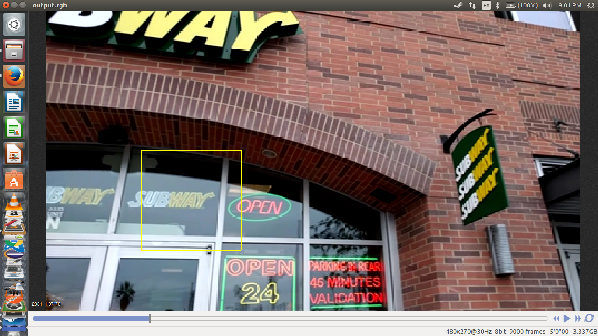
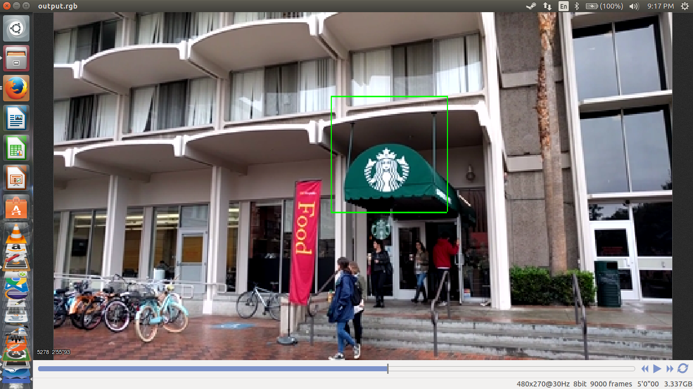

CSCI 576: Multimedia Design Systems Project - Advertisement Filtration and Logo Detection
==========================================================================================

This project was completed in Fall 2016 as a requirement for CSCI 576 which is taught by Dr. Parag Havaldar at the University
of Southern California. The aim of this project is to filter advertisements from a given RGB video file and replace these 
advertisements with those pertaining to the logos which are detected in video segments before the original advertisements.

Part 1: Video Player
--------------------
A video player was designed with 'Play', 'Pause' and 'Stop' buttons. 

Part 2: Advertisement filtration
---------------------------------
Firstly, the video file is divided into shots which represent scene changes. Shots are created by comparing the interframe difference
of the current frame and the previous frame with a threshold which is dynamically determined by using the average and deviation of 
interframe differences of 5 previous frames in a sliding window. The main advantage of the sliding window is that it is sensitive to
gradual and sudden pan motions of the camera. The shots are stored as an array and it is processed further to separate the
advertisements from the desirable shots. These desirable shots are represented by scenes.

In order to decide whether a shot is an advertisement, the shot array is filtered to contain shots which have a high probability of
being an advertisement, based on the length of each shot. The audio file is then analyzed for determining peaks in RMS power values
of amplitudes. The probability of an advertisement being a shot is directly proportional to the number of peaks/deviations in RMS
power values, and is inversely proportional to the length of the shot. This metric is used to identify shots which contain 
advertisements.

Part 3: Logo Detection
----------------------
After advertisement filtration, the remaining (desirable) shots undergo logo detection. Color statistics is the only statistical
metric which is used for detection. Every frame is divided into blocks of 90x90. For each block, its histogram is compared with
the histogram of the logo. The absolute pixel density per color is not compared. Instead, the percentage contribution of the pixels
of the logo and the frame block are compared using a bell curve to determine the closeness of the block histogram with the logo 
histogram. This 'closeness' is expressed in terms of confidence values which are then aggregated for each block in the frame. The 
block with the highest confidence which passes a threshold is highlighted as a probable logo. Four logos were given - Starbucks, Subway,
NFL and McDonald's. The HSL color space is used as it is easier to make histograms based on hue while all colors are ordered in terms of
lightness.This method did give a few false positives. In a given sequence of desirable shots, the advertisement video of the
logo with the most number of hits, is used to replace the original advertisement in the same spot. This is used to simulate
subliminal advertising.

*NOTE: Video and audio files are not included in this repository*

Sample Screenshot (Subway)
--------------------------

Sample Screenshot (Starbucks)
--------------------------

